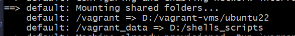

# Continuous integration with Jenkins

### Jenkins installation:

Jenkins documentation: [https://www.jenkins.io/doc/](https://www.jenkins.io/doc/)

Installing Jenkins on Linux:

Jenkins need java installed

```
#!/bin/bash

sudo apt update
sudo apt install openjdk-11-jre -y
#sudo apt install maven -y

curl -fsSL https://pkg.jenkins.io/debian-stable/jenkins.io-2023.key | sudo tee \
  /usr/share/keyrings/jenkins-keyring.asc > /dev/null
echo deb [signed-by=/usr/share/keyrings/jenkins-keyring.asc] \
  https://pkg.jenkins.io/debian-stable binary/ | sudo tee \
  /etc/apt/sources.list.d/jenkins.list > /dev/null
sudo apt-get update
sudo apt-get install jenkins -y
```

To Install additional tools on Jenkins:

<figure><figcaption></figcaption></figure>

e.g. install jdk8:

* Download jdk8 on linux machine. To see installed versions:  ll /usr/lib/jvm
* Provide jdk8 path in Jenkins:

<figure><figcaption></figcaption></figure>

* It's recommended to save .war files or any other if needed, e.g.

<figure><figcaption></figcaption></figure>

### Versioning

It's possible to create versioning in jenkins, e.g. lets version .war file, using shll cmd with envirenment variable (BUILD\_ID) to vreate new version file everytime built is run:

<figure><figcaption></figcaption></figure>

```
mkdir -p versions
cp target/vprofile-v2.war versions/vprofile-V$BUILD_ID.war
```

<figure><figcaption></figcaption></figure>
